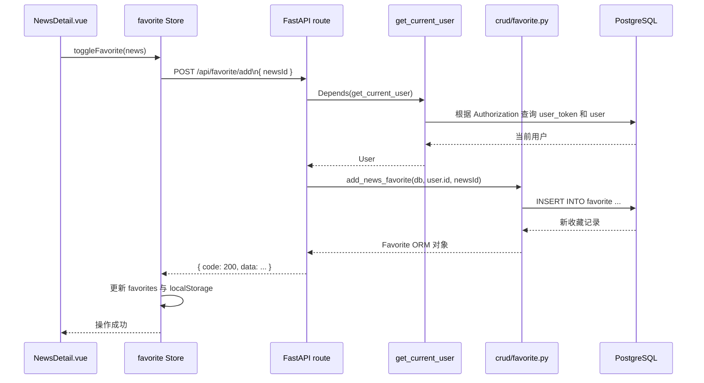

# 新闻资讯项目：前后端 CRUD 串联流程

本文以当前 `toutiao` 项目的真实代码为准，说明一次用户操作如何从 Vue 页面流向 FastAPI、SQLAlchemy 和 PostgreSQL，再将结果同步回前端。

## 1. 项目分层与职责

```text
用户操作
  ↓
Vue 页面（views/、components/）
  ↓ 调用
Pinia Store（store/，维护页面状态并使用 axios 请求接口）
  ↓ HTTP / JSON
FastAPI 路由（backend/routes/，参数校验、鉴权、组装响应）
  ↓ 调用
CRUD 层（backend/crud/，封装数据库操作）
  ↓ 使用
SQLAlchemy ORM 模型（backend/models/）
  ↓
PostgreSQL 表（user、user_token、news、favorite、history 等）
```

前端请求基地址统一配置在 `news-headline-frontend/src/config/api.js`：

```js
export const apiConfig = {
  baseURL: 'http://127.0.0.1:8000',
}
```

后端由 `backend/main.py` 注册新闻、用户、收藏和历史四组路由。成功响应通过 `backend/utils/response.py` 统一为：

```json
{
  "code": 200,
  "message": "success",
  "data": {}
}
```

出现业务错误时，`backend/utils/exception_handlers.py` 注册的全局异常处理器也会返回同样的 `code / message / data` 结构，只是 HTTP 状态码和 `code` 会变为 `400`、`401`、`404` 或 `500`。

## 2. CRUD 在本项目中的对应关系

新闻模块主要对访客开放查询；完整的增、删、改、查分布在用户、收藏和浏览历史模块中。

| 操作 | 业务场景 | 前端入口 | 后端接口 | 数据表 |
| --- | --- | --- | --- | --- |
| Create | 用户注册 | `Register.vue` -> `userStore.register` | `POST /api/user/register` | `user`、`user_token` |
| Read | 新闻分类、列表、详情 | `Home.vue`、`NewsDetail.vue` -> `newsStore` | `GET /api/news/*` | `news_category`、`news` |
| Update | 修改个人资料、密码、新闻浏览量、重复浏览历史刷新时间 | `Profile.vue` -> `userStore`；查看详情 | `PUT /api/user/*`；`GET /api/news/detail`；`POST /api/history/add` | `user`、`news`、`history` |
| Delete | 取消收藏、清空收藏、删除历史、清空历史 | `Favorite.vue`、`History.vue` -> 对应 Store | `DELETE /api/favorite/*`、`DELETE /api/history/*` | `favorite`、`history` |
| Create / Read / Delete | 收藏、浏览历史 | `NewsDetail.vue`、`Favorite.vue`、`History.vue` | `/api/favorite/*`、`/api/history/*` | `favorite`、`history` |

## 3. 一次请求的通用生命周期

以需要登录的“添加收藏”为例，整条请求链如下：



各层应当各司其职：

| 层级 | 主要职责 | 本项目示例 |
| --- | --- | --- |
| 页面 / 组件 | 接收点击、表单输入，显示列表、加载和提示 | `NewsDetail.vue` 的收藏按钮 |
| Pinia Store | 调用接口，维护 `loading`、列表、用户和 Token 等状态 | `store/modules/favorite.js` |
| 路由层 | 定义 URL 和 HTTP 方法，使用 Pydantic 校验参数，调用鉴权和 CRUD，返回响应 | `routes/favorite.py` |
| CRUD 层 | 只处理查询、新增、更新、删除及事务提交 | `crud/favorite.py` |
| ORM / 数据库 | 模型映射表和字段，数据库执行约束与持久化 | `models/favorite.py`、`favorite` 表 |

## 4. 登录态如何贯穿 CRUD

注册或登录成功后，后端会返回用户信息和 Token：

```json
{
  "code": 200,
  "message": "登录成功",
  "data": {
    "token": "xxxxxxxx-xxxx-xxxx-xxxx-xxxxxxxxxxxx",
    "userInfo": {
      "id": 1,
      "username": "admin",
      "bio": "..."
    }
  }
}
```

前端 `store/user.js` 将 `userInfo`、`token` 和 `isLogin` 写入 Pinia。收藏、历史、个人资料等 Store 请求接口时，会带上：

```http
Authorization: <token>
```

后端 `utils/auth.py` 的 `get_current_user` 是一个 FastAPI 依赖：

1. 从 `Authorization` 请求头取出 Token；同时兼容原始 Token 和 `Bearer <token>` 格式。
2. 调用 `crud/users.py` 的 `get_user_by_token` 查询 `user_token` 表。
3. 验证 Token 是否存在、是否已过期，再查询 `user` 表。
4. 验证通过后把 `User` 对象注入路由函数；失败时返回 `401`。

因此，路由层不需要相信前端传入的 `userId`。所有用户私有数据都以 `get_current_user` 得到的 `user.id` 为准，例如：

```python
result = await favorite.add_news_favorite(db, user.id, data.news_id)
```

## 5. Read：新闻分类、列表与详情

### 5.1 首页读取新闻分类和列表

页面初始化时，`Home.vue` 依次执行：

```text
Home.vue onMounted
  -> newsStore.getCategories()
  -> GET /api/news/categories
  -> newsStore.getNewsList()
  -> GET /api/news/list?categoryId=1&page=1&pageSize=10
```

新闻列表的后端流程：

```text
routes/news.py:get_news_list
  -> 从 categoryId、page、pageSize 计算 offset
  -> crud/news.py:get_news_list
  -> SELECT news WHERE category_id = ? OFFSET ? LIMIT ?
  -> crud/news.py:get_news_count
  -> SELECT COUNT(*) FROM news WHERE category_id = ?
  -> 组装 list、total、hasMore
  -> 返回统一 JSON
```

前端 `newsStore.getNewsList` 收到成功响应后，将 `data.list` 合并到 `newsList`。下拉刷新传入 `true`，会从第一页开始替换列表；触底加载则根据当前数量计算下一页。

分页响应示例：

```json
{
  "code": 200,
  "message": "获取新闻列表成功",
  "data": {
    "list": [],
    "total": 403,
    "hasMore": true
  }
}
```

### 5.2 查看详情时的 Read + Update

点击 `NewsItem.vue` 后，前端路由跳转到 `/news/detail/:id`。`NewsDetail.vue` 挂载后调用：

```text
newsStore.getNewsDetail(id)
  -> GET /api/news/detail?id=<新闻 ID>
```

该接口并非纯查询，而是把读新闻与“浏览量加 1”串成一次业务流程：

```text
routes/news.py:get_news_detail
  -> crud/news.py:get_news_detail：SELECT 指定新闻
  -> 未找到则返回 404
  -> crud/news.py:increase_news_views：UPDATE news SET views = views + 1
  -> crud/news.py:get_related_news：查询同分类相关推荐
  -> 返回新闻详情、最新浏览量和相关推荐
```

页面拿到详情后，若用户已登录，还会额外调用 `historyStore.addHistoryApi(newsId)` 记录浏览历史。这是前端发起的第二个请求，与“浏览量加 1”分别保存两个不同的业务数据。

## 6. Create / Read / Delete：收藏流程

### 6.1 添加或取消收藏

用户在 `NewsDetail.vue` 点击星标：

```text
NewsDetail.vue:toggleFavorite
  -> favoriteStore.toggleFavorite(news)
  -> 已收藏：DELETE /api/favorite/remove?newsId=<id>
  -> 未收藏：POST /api/favorite/add，Body: { "newsId": <id> }
```

添加收藏的后端链路：

```text
routes/favorite.py:add_favorite
  -> FavoriteAddRequest 校验请求体的 newsId
  -> get_current_user 验证 Token，得到 user.id
  -> crud/favorite.py:add_news_favorite
  -> 创建 Favorite(user_id, news_id)
  -> db.add() -> db.commit() -> db.refresh()
  -> success_response()
```

数据库 `favorite` 表为 `(user_id, news_id)` 加了唯一约束，因此同一用户不能重复收藏同一篇新闻。约束冲突由全局异常处理器转成 `400` 响应。

取消收藏的 CRUD 操作是按当前用户和新闻 ID 同时限定的删除：

```sql
DELETE FROM favorite
WHERE user_id = :current_user_id AND news_id = :news_id;
```

前端只有在接口成功后才更新本地 `favorites`，随后写入 `localStorage`，让星标状态和收藏列表立刻变化。

### 6.2 读取、删除和清空收藏列表

进入 `Favorite.vue` 后：

```text
Favorite.vue onMounted
  -> favoriteStore.getFavoriteListApi()
  -> GET /api/favorite/list?page=1&pageSize=10
  -> routes/favorite.py:get_favorite_list
  -> crud/favorite.py:get_favorite_list
  -> News JOIN Favorite，按 Favorite.created_at 倒序分页
  -> 返回新闻信息 + favoriteId + favoriteTime
```

删除单条收藏和清空收藏分别对应：

| 用户操作 | Store 方法 | HTTP 请求 | CRUD 函数 |
| --- | --- | --- | --- |
| 删除一条 | `removeFavoriteApi(id)` | `DELETE /api/favorite/remove?newsId=<id>` | `remove_news_favorite` |
| 清空全部 | `clearFavoritesApi()` | `DELETE /api/favorite/clear` | `remove_all_favorites` |

## 7. Create / Read / Update / Delete：浏览历史流程

浏览历史的关键点是“同一新闻第二次浏览不新增一行，而是刷新浏览时间”，因此它实际覆盖了 Create 和 Update 两种行为。

### 7.1 打开详情时写入历史

```text
NewsDetail.vue onMounted
  -> 获取新闻详情成功
  -> 用户已登录时调用 historyStore.addHistoryApi(newsId)
  -> POST /api/history/add，Body: { "newsId": <id> }
```

后端 `crud/history.py:add_history` 的逻辑如下：

```text
先按 user_id + news_id 查询 history
  -> 已存在：history.view_time = 当前时间（Update）
  -> 不存在：db.add(History(...))（Create）
  -> db.commit() + db.refresh()
```

这让每篇新闻在一个用户的历史列表中只保留一条记录，并按最近浏览时间排序。

### 7.2 查询和删除历史

进入 `History.vue` 时，Store 请求 `GET /api/history/list`。后端用 `News JOIN History` 获取新闻完整信息，并按 `History.view_time DESC` 分页。返回结果中的 `viewTime` 直接用于页面展示。

| 用户操作 | HTTP 请求 | CRUD 函数 | 数据库动作 |
| --- | --- | --- | --- |
| 获取历史 | `GET /api/history/list` | `get_history_list` | 联表查询 + 分页 |
| 删除一条 | `DELETE /api/history/delete/{newsId}` | `delete_history` | 按 `user_id + news_id` 删除 |
| 清空全部 | `DELETE /api/history/clear` | `clear_history` | 按 `user_id` 删除 |

未登录时，历史 Store 的读取和删除会回退到浏览器 `localStorage`；登录后，以后端接口返回的数据为准。

## 8. Create / Read / Update：用户流程

### 8.1 注册与登录

注册和登录都由 `Register.vue`、`Login.vue` 调用 `userStore`：

```text
注册：POST /api/user/register
  -> 查询 username 是否已经存在
  -> bcrypt 哈希密码
  -> INSERT user
  -> 创建或更新 user_token
  -> 返回 token + userInfo

登录：POST /api/user/login
  -> 查询 user
  -> bcrypt 校验密码
  -> 创建或更新 user_token
  -> 返回 token + userInfo
```

密码不会以明文写入数据库：`crud/users.py:create_user` 调用 `utils/security.py:get_hash_password` 后才创建用户。

### 8.2 读取和更新个人资料

`My.vue` 和 `Profile.vue` 会调用 `userStore.getUserInfoDetail()`：

```text
GET /api/user/info
  -> get_current_user
  -> 返回当前 User 的 Pydantic 响应模型
```

用户编辑个人简介时，设计上的链路为：

```text
Profile.vue
  -> userStore.updateUserBio(bio)
  -> PUT /api/user/update，Body: { "bio": "..." }
  -> routes/users.py:update_user_info
  -> crud/users.py:update_user
  -> UPDATE user SET bio = ...
  -> 返回更新后的用户信息
  -> 前端同步 userStore.userInfo.bio
```

修改密码的请求为 `PUT /api/user/password`，请求体使用驼峰字段：

```json
{
  "oldPassword": "旧密码",
  "newPassword": "至少 6 位的新密码"
}
```

后端先校验旧密码，再对新密码哈希后更新 `user.password`。

## 9. 前后端字段名对齐

前端 JavaScript 通常使用驼峰命名，数据库和 Python ORM 常使用下划线命名。后端 Pydantic Schema 通过 `Field(alias=...)` 完成映射：

| 前端字段 | 后端 Schema / ORM 字段 | 使用位置 |
| --- | --- | --- |
| `newsId` | `news_id` | 添加收藏、添加历史 |
| `pageSize` | `page_size` | 收藏、历史、新闻分页 |
| `userInfo` | `user_info` | 登录、注册响应 |
| `isFavorite` | `is_favorite` | 收藏状态 |
| `hasMore` | `has_more` | 分页响应 |
| `favoriteTime` | `favorite_time` | 收藏列表 |
| `viewTime` | `view_time` | 历史列表 |
| `oldPassword` / `newPassword` | `old_password` / `new_password` | 修改密码 |

新增接口时，前后端要先确定 URL、HTTP 方法、请求字段、响应字段和错误码；如果命名风格不同，应在 Schema 的 alias 中统一处理，而不是由页面临时拼接字段名。

## 10. 开发一个新 CRUD 功能的落地顺序

以“用户评论”功能为例，可以复用项目现有结构：

1. 在 `db/database.sql` 设计 `comment` 表，并定义外键、索引和唯一约束。
2. 在 `backend/models/` 创建 SQLAlchemy ORM 模型。
3. 在 `backend/schemas/` 定义创建、更新和列表响应的 Pydantic 模型，并处理驼峰字段别名。
4. 在 `backend/crud/comment.py` 封装 `create`、`get_list`、`update`、`delete`，由 CRUD 层负责事务提交。
5. 在 `backend/routes/comment.py` 定义 `POST`、`GET`、`PUT`、`DELETE` 接口；私有操作通过 `Depends(get_current_user)` 锁定当前用户。
6. 在 `backend/main.py` 使用 `app.include_router(comment.router)` 注册路由。
7. 在前端创建或扩展 Pinia Store，用 Axios 请求接口，并在成功后更新本地状态。
8. 在 Vue 页面绑定输入、点击、加载和失败提示；不要让页面直接编写数据库或鉴权逻辑。

最终调用链保持一致：

```text
Vue 页面
  -> Pinia Store
  -> Axios HTTP 请求
  -> FastAPI 路由 + Pydantic 校验 + Depends 鉴权
  -> CRUD 函数
  -> SQLAlchemy ORM
  -> PostgreSQL
  -> 统一 JSON 响应
  -> Store 更新状态
  -> Vue 自动刷新界面
```

## 11. 联调检查清单

- 后端启动后，可访问 `http://127.0.0.1:8000/docs` 查看所有接口和请求模型。
- 前端 `apiConfig.baseURL` 必须指向实际的后端地址与端口。
- 登录后检查浏览器 Network：收藏、历史和资料更新请求是否携带 `Authorization`。
- 接口成功时，前端应检查 `response.data.code === 200`，再更新 Pinia 状态。
- 接口失败时，使用 `response.data.message` 展示提示；不要把失败结果当作成功数据写入列表。
- 对分页接口，前端使用后端返回的 `hasMore` 控制是否继续加载。
- 对用户私有资源，后端删除或查询必须始终附带 `user.id` 条件，避免越权访问其他用户的数据。

## 12. 当前代码的联调注意项

本文前面的调用路径反映了项目的分层设计。联调时还需注意以下两处当前实现与前端预期不完全一致的问题：

1. `backend/crud/users.py` 的 `update_user` 已查询到 `updated_user`，但最后写成了 `return update_user`。这会把函数对象交给路由层，而不是更新后的用户对象，`PUT /api/user/update` 无法按预期返回用户资料。应改为 `return updated_user`。
2. 新闻列表直接返回 ORM 对象，其时间字段会是 `publish_time`；收藏、历史的 Schema 又将该字段别名定义为 `publishedTime`。但前端列表组件读取的是 `publishTime`。应统一为一个字段名，例如在所有新闻列表响应中固定返回 `publishTime`，以避免时间显示为空。

修正这些接口契约后，页面、Store、路由、Schema 与数据库之间的 CRUD 流程就能完全闭环。
